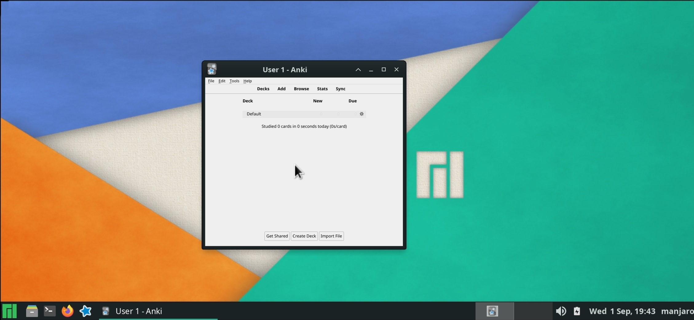

# Manjaro arm64 rootfs with xfce4 and tigervnc



> Manjaro rootfs with `xfce4` and `vncserver` preinstalled. Just setup username, password and vnc password.

## There are two releases
### 1. Manjaro
Manjaro arm64 with xfce4, xfce4-goodies, tigervnc and (no Anki)

### 2. Anki
Anki with Manjaro (xfce4 only, latest Anki and tigervnc)

|  | Manjaro 21.1.1  | Anki 2.1.47  |
| :---:   | :-: | :-: |
| vncserver | tigervnc | tigervnc |
| Anki | No | Yes |
| Download size | 1.0 GB | 0.7 GB |
| Installed Size | 4.0 GB | 2.8 GB |
| Desktop Env. | xfce4, xfce4-goodies | xfce4 (minimal) |

# QuickStart
1. Copy and run commands below in [Termux](https://f-droid.org/en/packages/com.termux)
2. Select `Install the latest rootfs`
3. Wait for download to complete
4. Set username and password
5. Type `vncserver-start` and vnc password
6. Open [RealVNC](https://play.google.com/store/apps/details?id=com.realvnc.viewer.android) and connect to `localhost:5901`.

    View more tutorials [here](https://github.com/infinyte7/manjaro-fs-arm64/wiki).

## Manjaro arm64 with xfce4, xfce4-goodies and tigervnc
Copy and run it in Termux
```
pkg install wget && wget https://raw.githubusercontent.com/infinyte7/manjaro-fs-arm64/main/manjaro.sh && chmod +x manjaro.sh && ./manjaro.sh
```

## Anki with Manjaro (xfce4 (minimal), latest Anki and tigervnc)
Copy and run it in Termux
```
pkg install wget && wget https://raw.githubusercontent.com/infinyte7/manjaro-fs-arm64/main/manki.sh && chmod +x manki.sh && ./manki.sh
```

## To proot into already installed rootfs
### For Manjaro
```
./manjaro.sh
```
### For Anki
```
./manki.sh
```

## View wiki for more tutorials
[View wiki](https://github.com/infinyte7/manjaro-fs-arm64/wiki)

### View Demo
https://user-images.githubusercontent.com/12841290/131765043-3abc5d62-e4b5-440f-b740-2e305b43ebe7.mp4

# License and Credits
- [Manjaro ARM](https://manjaro.org/)

- Manjaro on Android (manjaro-fs-arm64)<br>
    Mani (Infinyte7)<br>GPL v3

- [AndronixOrigin](https://github.com/AndronixApp/AndronixOrigin)<br>MIT License

- ItsMeKuroro<br>[https://forum.manjaro.org](https://archived.forum.manjaro.org/t/how-to-run-the-official-manjaro-arm-edition-on-android-with-chroot-environment/151429)

- [undocker](http://github.com/larsks/undocker)<br>
    GPL v3